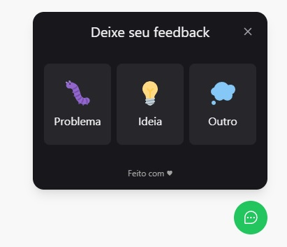
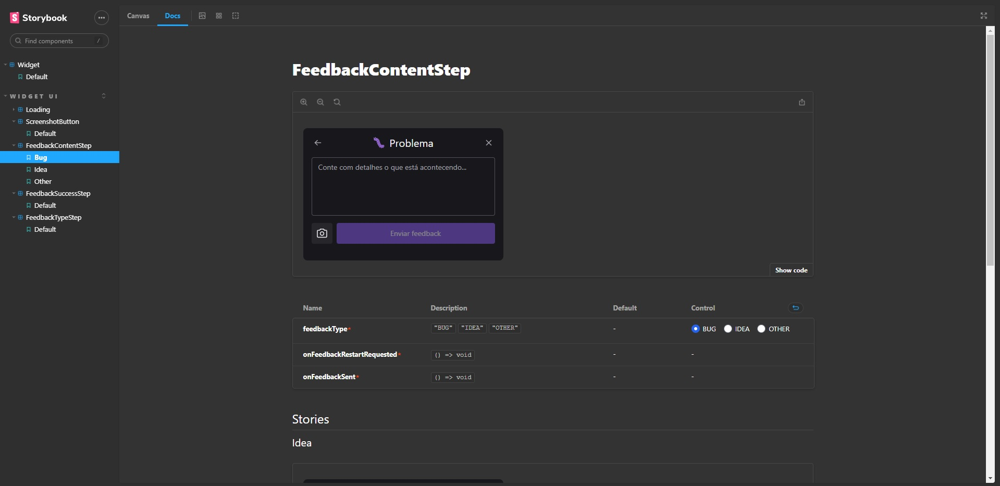

# Estudos iniciais Storybook

## Tabela de conteúdos

- [Estudos iniciais Storybook](#estudos-iniciais-storybook)
  - [Tabela de conteúdos](#tabela-de-conteúdos)
  - [Visão Geral](#visão-geral)
    - [A Aplicação](#a-aplicação)
    - [Captura de Tela](#captura-de-tela)
    - [Recursos utilizados](#recursos-utilizados)
  - [Pré-requisitos](#pré-requisitos)
    - [Aplicação Popover](#aplicação-popover)
    - [Storybook](#storybook)
  - [Autor](#autor)

## Visão Geral

### A Aplicação

A aplicação consiste em um Popover para envio de problemas, ideias ou outros assuntos, com a opção de printscreen no próprio componente para facilidade decifrar as questões enviadas.

O objetivo principal foi realizar a documentação da interface com Storybook que é uma ferramenta excepcional para esta finalidade e a assim fixar o aprendizado.

Todos os componentes foram documentados mais existe muito a se evoluir.

### Captura de Tela

### Recursos utilizados

- [yarn](https://yarnpkg.com/) - Gerenciador de pacotes do projeto.
- [TypeScrip](https://www.typescriptlang.org/) - Uma linguagem de programação fortemente tipada que se baseia em JavaScript.
- [PhosphorIcons](https://phosphoricons.com/) - Pacote de ícones
- [Storybook](https://storybook.js.org/) - Um workshop de front-end para criar componentes de interface do usuário e páginas isoladamente.

## Pré-requisitos

### Aplicação Popover

Para executar o projeto *local* utilizamos os comandos após realizar o download ou clone do repositório:

Instalar a dependencias do projeto:

> yarn install

Logo em seguida para executarmos a aplicação:

> yarn run dev

E a aplicação estará pronta para ser visualizada no endereço [http://localhost:5173](http://localhost:5173).

### Storybook

Apos realizar o procedimento de instalar as dependencias do projeto pordemos usar o comando:

> yarn storybook

E a o Storybook sera montando no endereço [http://localhost:6006](http://localhost:6006).

## Autor

Danilo Calegaro - [danilocalegaro.dev.br](https://danilocalegaro.dev.br/)
